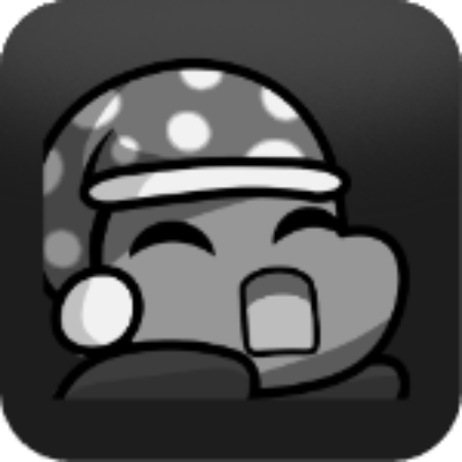

 

<b>Personal Portfolio Website</b>

<a href="https://lesh.me">Website</a>
&nbsp;&nbsp;•&nbsp;&nbsp;
<a href="https://lesh.me/#projects">Projects</a>
&nbsp;&nbsp;•&nbsp;&nbsp;
<a href="https://lesh.me/#experiences">Experience</a>
&nbsp;&nbsp;•&nbsp;&nbsp;
<a href="https://twitter.com/derlesh">Twitter (X)</a>

My personal website and portfolio contains an overview of my projects and what technologies I've used.
It's a refresh of my old portfolio with a new look and feel and a small easter egg.

## 📦 Stack

- [**Next.js**](https://nextjs.org/) - React framework
- [**Tailwind CSS**](https://tailwindcss.com/) - Utility-first CSS framework
- [**TypeScript**](https://www.typescriptlang.org/) - Static type system
- [**Lucide Icons**](https://lucide.dev/) - Icon library
- [**shadcn/ui**](https://ui.shadcn.com/) - Component library
- [**svgl**](https://svgl.app/) - SVG logo library

